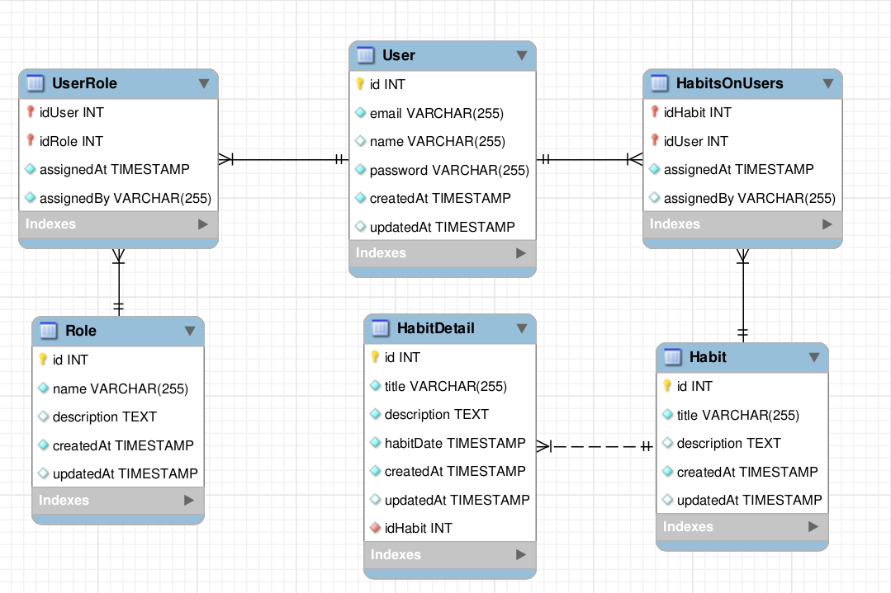

# nodeApi
esto es una api para poner en practica mi conocimiento tanto como backend como en base de datos, mi idea es hacer esto como backend y crear una api robusta para luego ser consumida por un frontend.

## funciones principales
 CRUD de usuarios y de habitos (sin eliminar por ahora). 

## tecnologías
- node
- typescript
- prisma (postgresql)
- express
- bcrypt

### modelo bd
screenshot de la base de datos actual

*revisar prisma/prisma.shema en caso de cambios no actualizados.

### proximamente
la idea es que este mismo proyecto vaya escalando cada vez más ya se en complejidad como en tamaño, es decir aplicaré estructuras, metodologias y nuevos conocimientos que vaya adquiriendo.